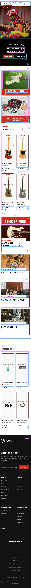
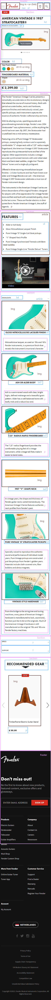
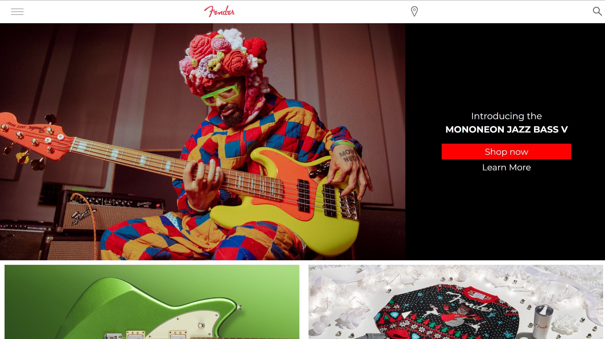
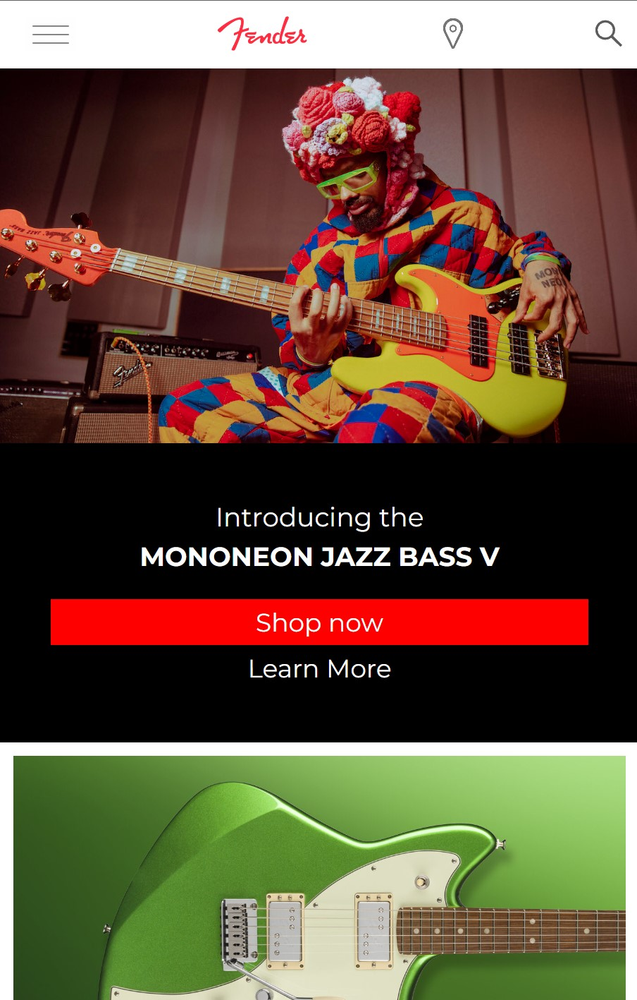
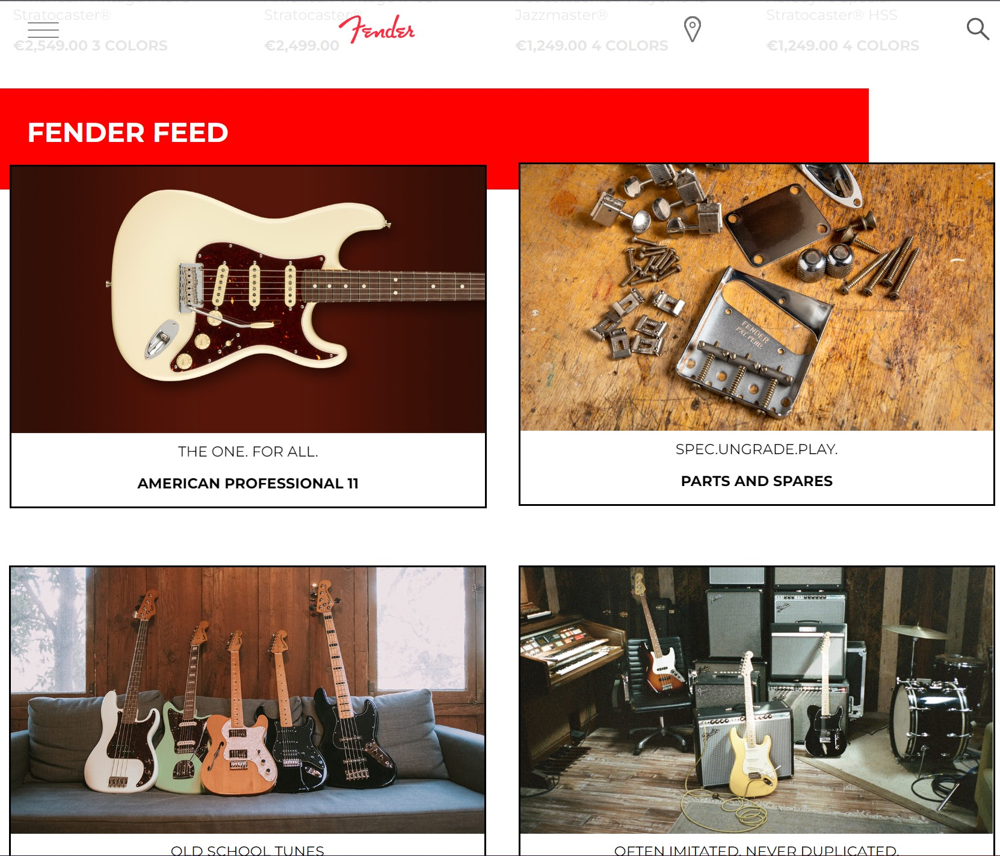
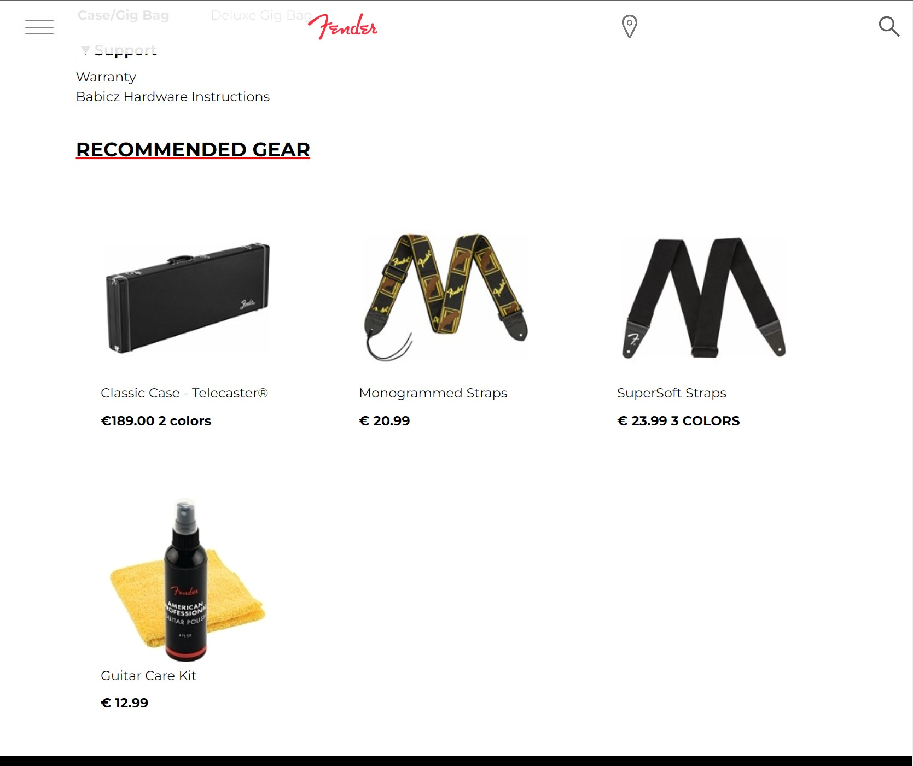

# Procesverslag
Markdown is een simpele manier om HTML te schrijven.  
Markdown cheat cheet: [Hulp bij het schrijven van Markdown](https://github.com/adam-p/markdown-here/wiki/Markdown-Cheatsheet).

Nb. De standaardstructuur en de spartaanse opmaak van de README.md zijn helemaal prima. Het gaat om de inhoud van je procesverslag. Besteedt de tijd voor pracht en praal aan je website.

Nb. Door *open* toe te voegen aan een *details* element kun je deze standaard open zetten. Fijn om dat steeds voor de relevante stuk(ken) te doen.

## Jij

  
uitwerken voor kick-off werkgroep

  ### Auteur:
  Naomi Jagtman

  #### Je startniveau:
  Blauwe piste

  #### Je focus:
  Responsive
 

## Je website

  
uitwerken voor kick-off werkgroep

  ### Je opdracht:
  https://www.fender.com

  #### Screenshot(s) van de eerste pagina (small screen): 
  Homepagina
  

  #### Screenshot(s) van de tweede pagina (small screen):
  Productenpagina
  
 

## Toegankelijkheidstest 1/2 (week 1)

  
uitwerken na test in 1e werkgroep

  ### Bevindingen
  Lijst met je bevindingen die in de test naar voren kwamen:

  #### Screenreader
  De narrator leest dingen op die niet op de website te zien zijn (misschien tekst uit een menu?). Ook is er bij de producten gebruikt gemaakt van 2 links (een foto en tekst), dus dit wordt twee keer opgelezen. Kopjes zoals 'accesories' en 'what's new worden overgeslagen. De kleur op de productpagina wordt opgelezen als 'group' ipv dat de kleur wordt opgelezen. Dit is erg verwarrend als de gebruiker een product wilt kopen. De tekst op de productpagina (omschrijving) wordt helemaal niet opgelezen. 

  De problemen kunnen worden opgelost door goede benamingen te geven aan bepaalde elementen. Ook moet de kleur anders worden weergegeven, zo weet je nog steeds helemaal niks. Sommige linkjes die in tweeen verdeeld zijn kunnen als 1 link gemaakt worden, dit kost weer tijd.

  #### Muis en Toetsenbord 
  Met een toetsenbord navigeren door de website van fender is opzich prima, alleen bij een paar bepaalde afbeeldingen kan je het 'hokje' wel kwijtraken. De volgorde van het tabben is logisch. Op de productpagina is het een ander verhaal. Je ziet het 'hokje' wel goed, alleen je kan nergens op 'klikken' met de enter toets. Je kan dus bijvoorbeeld geen andere foto van het product bekijken. Een andere kleur selecteren met de enter toets kan dan weer wel. Als je in de nav bar bent en je klikt op enter ga je gelijk naar een andere pagina ipv dat je een submenu te zien krijgt.

  Om dit beter te maken kan het 'hokje' die je ziet als je door de site tabt best wel wat duidelijker gemaakt worden. Dit voorkomt verwarring. Ook is het belangrijk dat je met de tabtoets ook de andere productfoto's aanklikbaar maakt.

  #### Motoriek (shocks, elastiekjes)
  De tekst onder de foto's is niet helemaal aanklikbaar op de website. Als je een motorisch probleem hebt, is het wel fijn dat je een groot klikgebied hebt. 

  Om dit beter te maken is het goed om de gehele afbeelding + tekst van een product klikbaar te maken. 

  #### Visueel (brillen, contrast, kleurenblind, dark/light). 
  Met de bril waardoor je wazig ziet zijn de kleine letters niet zo goed te lenzen (vooral die onder productlinks en de productbeschrijving).  Met de accessebility test op de inspector op google chrome is de website op alle standen goed te lezen.
  Ook zijn er in veel links op de homepagina geen states gebruikt. Hierdoor krijgt de gebruiker geen feedback waar de muis op staat (:hoover state).

  Om dit beter te maken kan het lettertype wat groter gemaakt worden en kunnen er states worden toegevoegd. 

## Breakdownschets (week 1)

  
uitwerken na afloop 2e werkgroep

  ### de hele pagina: 
  

  ### dynamisch deel (bijv menu): 
  

## Voortgang 1 (week 2)

  
uitwerken voor 1e voortgang

  ### Stand van zaken
  Ik vind het tot nu toe vooral lastig. Ik ben al een aantal dagen aan het worstelen om mijn html goed te krijgen. Tot nu toe heb ik dit :
  
  
  maar ik heb het idee dat het nog steeds niet klopt. Om te kunnen beginnen aan mijn css wil ik natuurlijk eerst dat mijn HTML goed staat voordat ik het weer allemaal opnieuw zou moeten doen. 
  
  Tot nu toe ziet de website die ik heb gemaakt (met puur HTML en een klein beetje css) er zo uit:
  

  ### Agenda voor meeting
  samen met je groepje opstellen

  | student 1      | student 2          | student 3    | student 4        |
  | HTML           | HTML/CSS           | positioneren | ?       |

  ### Verslag van meeting
  hier na afloop snel de uitkomsten van de meeting vastleggen

  - HTML doorgelopen, klopt nu dus kan verder met de css en de pagina vormgeven.
  - uitleg gekregen over positioneren

## Voortgang 2 (week 3)

  
uitwerken voor 2e voortgang

  ### Stand van zaken
  Gaat al wel wat beter dan vorige week en ik ben ook verder (heb nu ook een tweede pagina, maar wel alleen de HTML) alleen ik ben wel bang dat ik het niet af ga krijgen in de anderhalve week die we nog hebben, het lijkt allemaal wat veel voor de tijd die we ervoor hebben. 

  Homepage van mijn site tot nu toe:
  

  ### Agenda voor meeting
  samen met je groepje opstellen

  | student 1      | student 2          | student 3            | student 4        |
  | HTML/CSS       | Waar sta ik?       | Ben ik goed op weg?  | Grid             |
 

  ### Verslag van meeting
  hier na afloop snel de uitkomsten van de meeting vastleggen

  - Veel nuttige vragen kunnen stellen over css dingen en soort van geleerd hoe je calc moet gebruiken. Ben voor de rest redelijk goed op weg. 

## Toegankelijkheidstest 2/2 (week 4)

  
uitwerken na test in 8e werkgroep

  ### Bevindingen
  Lijst met je bevindingen die in de test naar voren kwamen (geef ook aan wat er verbeterd is):

  #### Screenreader
  Hij leest in mijn site 2x dezelfde tekst op (van een plaatje en een link) omdat de alt tekst hetzelfde is als de link bij de foto. 
  
  Dit kan ik veranderen door de alt tekst weg te halen of aan te passen naar een beschrijving van de foto. 

  #### Muis en Toetsenbord 
  De tab is duidelijk, je kan goed zien waar je bent als je met het toetsenbord door de website navigeert. Wel tab je in het hamburger menu zonder dat je ziet dat je erin zit. 
  
  Dit kan worden opgelost door focus within toe te voegen aan het menu, zo gaat het hamburger menu open als je tab't en zie je waar je bent.

  ### Afbeelding toevoegen van focus state

  #### Motoriek (shocks, elastiekjes)
  Alle foto's met tekst eronder zijn nu geheel klikbaar. Zo hoef je als je bijvoorbeeld parkinson, spasmes of een ander probleem hebt niet heel precies te klikken om naar die pagina te gaan. 

  #### Visueel (brillen, contrast, kleurenblind, dark/light). 
  Ik het lettertype wat groter gemaakt dan op de huidige site zodat mensen met slechtere ogen de tekst beter kunnen lezen. Ook is het contrast van alle elementen goedgekeurd door de browser. 

## Voortgang 3 (week 4)

  
uitwerken voor 3e voortgang

  ### Stand van zaken
  Ik heb het gevoel dat het wel goed gaat (voor mijn doen). Moet wel nog veel dingen vragen. Ik ben vergeten een screenshot te nemen van mij code en pagina in week 4, sorry!

  ### Agenda voor meeting
  samen met je groepje opstellen

  | student 1      | student 2          | student 3     | student 4        |
  |                |                    |               |                  |
  | Laatste vragen |Kijken of alles wat | laatste vragen| Ben ik goed op   |
  | bespreken      |moet op de site     | stellen       | weg?             |

  ### Verslag van meeting
  hier na afloop snel de uitkomsten van de meeting vastleggen

  Ik heb alle vragen die relevant voor mij waren weer kunnen stellen, heb toch nog best wel een lange weg te gaan. Ben gewisseld van responsive. 

## Eindgesprek (week 5)

  
uitwerken voor eindgesprek

  ### Je uitkomst - karakteristiek screenshots:

  

  

  ### Dit ging goed/Heb ik geleerd: 
  
  Ik vind de fender feed van mijn homepagina best goed gelukt. Met een mediaquery is hij ook goed responsive. Eigenlijk alles wat ik in deze site heb toegepast heb ik er nieuw bij geleerd, internetstandaarden vond ik al moeilijk en dit was er niks bij.

  

  ### Dit was lastig/Is niet gelukt:
  
  Het is me niet gelukt om ervoor te zorgen dat de producten 2 om 2 verspringen in plaats van 1 voor 1. Dit vind ik wel jammer, had het wel mooi gevonden als dit gelukt was.

  

## Bronnenlijst

  
continu bijhouden terwijl je werkt

  Nb. Wees specifiek ('css-tricks' als bron is bijv. niet specifiek genoeg).

  1. Fender website (hier komen alle plaatjes vandaan) https://www.fender.com/en-US/start
  2. info over tables https://developer.mozilla.org/en-US/docs/Web/HTML/Element/table
  3. voor de selectoren https://www.w3schools.com/cssref/css_selectors.php
  4. Als referentie voor de slider https://codepen.io/dudleystorey/pen/KKPdeb?editors=1100
  5. Referentie responsive foto op de homepage https://www.youtube.com/watch?v=nHB-3WJTfSg
  6. En heb ook ontelbaar veel andere filmpjes gekeken op youtube https://www.youtube.com
  7. Heb hier veel op gelezen https://www.w3schools.com/
  8. Hier ook veel op gelezen https://developer.mozilla.org
  9. Veel info van DLO gehaald https://dlo.mijnhva.nl/d2l/home/437099 

